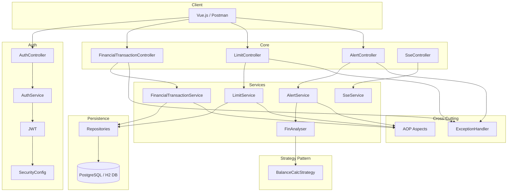

# Financial Tracker Backend

[](https://openjdk.java.net/projects/jdk/17/)
[](https://spring.io/projects/spring-boot)
[](https://maven.apache.org/)
[](LICENSE) <!-- Choose a license or remove this badge -->

## Table of Contents

*   [Overview](#overview)
*   [Motivation](#motivation)
*   [Key Features](#key-features)
*   [Architecture](#architecture)
*   [Technology Stack](#technology-stack)
*   [Running Locally](#running-locally)
*   [API Documentation](#api-documentation)
*   [Deployment Overview](#deployment-overview)
*   [License](#license)

## Overview

This project is the backend component for a **Financial Tracker Web Application**. It's primarily a **portfolio project** designed to showcase proficiency in **Java**, **Spring Boot**, and modern backend development practices.

The application allows users to record financial transactions (both income and expenses), set spending limits for various categories, and receive alerts if those limits are exceeded.

## Motivation

The main goal of this project was to learn and apply current best practices in backend development using the Spring Boot ecosystem. It serves as a practical demonstration of skills in building RESTful APIs, managing data persistence, implementing security, and structuring a backend application effectively. While not solving a unique real-world problem, it focuses on the technical implementation and architectural patterns relevant in today's software development landscape.

**Project Status:** Functionally complete and deployed, but open for further enhancements and refactoring.

## Key Features

*   **User Authentication & Authorization:** Secure registration and login using Spring Security and JWT (JSON Web Tokens).
*   **Transaction Management:** CRUD operations for recording income and expense transactions.
*   **Limit Setting:** Ability to define spending limits for different financial categories.
*   **Financial Analysis:** A dedicated `FinAnalyser` component utilizes the **Strategy Design Pattern** to compare transactions against set limits.
*   **Alert Generation:** Creates alerts when spending limits are breached based on the analysis.
*   **RESTful API:** Provides a clear API for frontend integration or direct interaction.

   ## Architecture

This application follows a **Layered Monolithic architecture**, primarily organized using a **Package-by-Feature** approach. This means the code is grouped by major functional areas (like `security`, `financial_transaction`, `limit`, `alert`). Within each feature package, a classic layered structure is generally applied.



## Technology Stack

*   **Language:** Java 17
*   **Framework:** Spring Boot 3.1.2
    *   **Spring Web:** For building RESTful APIs.
    *   **Spring Data JPA:** For data persistence with Hibernate as the provider.
    *   **Spring Security:** For authentication (JWT) and authorization.
*   **Database:**
    *   PostgreSQL (Used by default in the `prod` profile for production)
    *   H2 Database (Used by default in the `local` profile for development/testing)
*   **Build Tool:** Apache Maven
*   **Testing:**
    *   JUnit 5 (via `spring-boot-starter-test`)
    *   Mockito (via `spring-boot-starter-test`)
    *   Spring Test & Spring Security Test
    *   JavaFaker: For generating realistic test data.
*   **API & Data:**
    *   **Jackson:** For JSON serialization/deserialization.
    *   **Lombok:** To reduce boilerplate code (constructors, getters, setters, etc.).
*   **Authentication:** **JJWT** (Java JWT) library
*   **Containerization & Deployment:**
    *   **Docker & Docker Compose**
    *   Deployed on a VPS (Ubuntu 22.04)
    *   **Traefik:** As a reverse proxy and for automatic HTTPS/SSL certificate management.
 
## Running Locally

Follow these steps to get the application running on your local machine.

**Steps:**

1.  **Clone the repository:**
    ```bash
    git clone https://github.com/andreichernetskii/FinTrackerBackEnd
    ```

2.  **Navigate to the project directory:**
    Change your current directory to the root of the cloned project:
    ```bash
    cd FinTrackerBackEnd
    ```

3.  **Run the application using the `local` profile:**
    Execute the following Maven command in your terminal. This command starts the Spring Boot application and explicitly activates the `local` profile. This profile is typically configured (check `src/main/resources/application-local.yml`) to use the **H2 database, storing data directly in local files**, which simplifies local setup as it doesn't require a separate database installation.
    ```bash
    mvn spring-boot:run -Dspring-boot.run.profiles=local
    ```

4.  **Access the application:**
    Wait for the application to start. You should see log output in your terminal, including the Spring Boot banner and messages indicating the application is running (e.g., "Tomcat started on port(s): 8080").
    Once started, the backend API should be accessible at `http://localhost:8080`. You can now test the API endpoints using tools like Postman, or curl.

## API Documentation

API documentation is available via Swagger UI once the application is running. You can access it at:

`http://localhost:8080/swagger-ui.html`

## Deployment Overview

The application is currently deployed using the following setup:

*   **Platform:** Ubuntu 22.04 VPS
*   **Containerization:** **Docker** and **Docker Compose** are used to manage the backend application container and the PostgreSQL database container.
*   **Reverse Proxy:** **Traefik** handles incoming traffic, provides SSL termination (HTTPS) using Let's Encrypt certificates, and routes requests to the backend application container.
*   **Frontend:** This backend serves a separate **Vue.js 3** frontend application (running in its own container).

## License

This project is licensed under the MIT License - see the [LICENSE](LICENSE) file for details.
